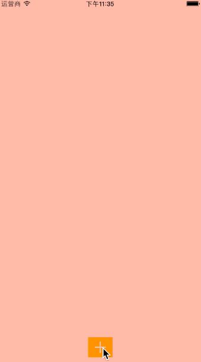

- 模仿新浪微博客户端底部功能添加按钮<br>


- 使用

```
    TPCItem *item1 = [TPCItem itemWithImage:[UIImage imageNamed:@"tabbar_compose_camera"] title:@"相机"];
    TPCItem *item2 = [TPCItem itemWithImage:[UIImage imageNamed:@"tabbar_compose_idea"] title:@"文字"];
    TPCItem *item3 = [TPCItem itemWithImage:[UIImage imageNamed:@"tabbar_compose_lbs"] title:@"签到"];
    TPCItem *item4 = [TPCItem itemWithImage:[UIImage imageNamed:@"tabbar_compose_more"] title:@"更多"];
    
    TPCItem *item5 = [TPCItem itemWithImage:[UIImage imageNamed:@"tabbar_compose_photo"] title:@"相册"];
    TPCItem *item6 = [TPCItem itemWithImage:[UIImage imageNamed:@"tabbar_compose_review"] title:@"点评"];
    NSArray *items = @[item1, item2, item3, item4, item5, item6];
    
    
    TPCSpringMenu *menu = [TPCSpringMenu menuWithItems:items];
    // 按钮文字颜色
    menu.buttonTitleColor = [UIColor blackColor];
    // 按钮行数
    menu.columns = 3;
    // 最后一个按钮与底部的距离
    menu.spaceToBottom = 100;
    // 按钮半径（只支持圆形图片，非圆形图片以宽度算）
    menu.buttonDiameter = 50;
    // 允许点击隐藏menu
    menu.enableTouchResignActive = YES;
    menu.dataSource = self;
    menu.delegate = self;
    [self.view addSubview:menu];
    _menu = menu;
    
    // 显示menu
    [_menu becomeActive];
```
- 后期再加入百度网盘效果
